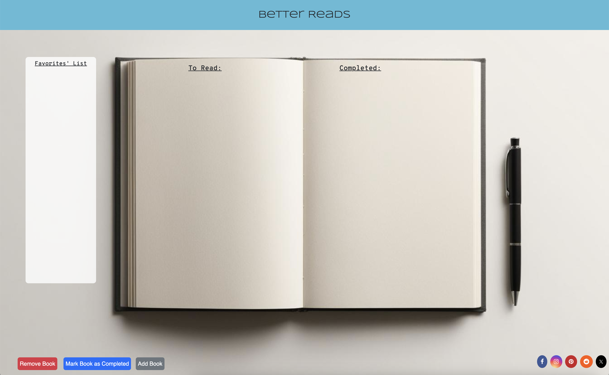

# Better-Reads

## User Story

AS a book enthusiast
I WANT TO compile a list of books in a book tracker
SO THAT I can see what books I have and have not read

## Acceptance Criteria

GIVEN A book tracker
WHEN I add a book to the "To Read" list
THEN it appears with a checkbox that can be clicked when the book has been read
WHEN the checkbox is clicked
THEN the user selects "Mark as Completed"
WHEN the rating and comments have been added and the submit button is clicked
THEN the book is moved to the "Completed" list
WHEN the book is rated 5 stars
THEN the user is given an option to add the book to the "Favorites' List"
WHEN the "Remove Book" button is clicked and the title of the book is added to the modal
THEN the book is removed from one of the three lists

## Screenshots

## Link to Deploy App

https://ashb88.github.io/Better-Reads/

## Link to the Repo

(https://github.com/AshB88/Better-Reads)

## Technologies Used

* [Bootstrap](https://getbootstrap.com/)
* [Project presentation template](https://docs.google.com/presentation/d/10QaO9KH8HtUXj__81ve0SZcpO5DbMbqqQr4iPpbwKks/edit?usp=sharing)
* [GoogleFonts](https://fonts.google.com/)
* [Github](https://github.com)
* [Unsplash](https://unsplash.com/)
* [Canva](https://www.canva.com/)